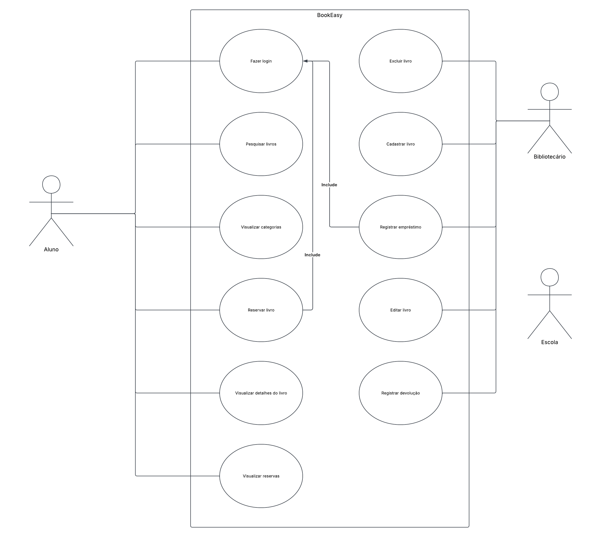

# Diagrama de Casos de Uso — BookEasy

## Sobre

O diagrama de casos de uso representa as principais funcionalidades do sistema **BookEasy** e a interação dos usuários com o sistema.

O BookEasy é um sistema de gerenciamento de biblioteca escolar desenvolvido para facilitar o acesso dos alunos aos livros e auxiliar no gerenciamento da biblioteca.

## Atores

O sistema possui três atores principais:

- **Aluno:** realiza a pesquisa e consulta de livros, além de poder realizar e visualizar reservas.
- **Bibliotecário:** realiza o gerenciamento dos livros e o controle de empréstimos e devoluções.
- **Escola:** representada por coordenadores, professores e administradores, possui as mesmas permissões administrativas do bibliotecário.

## Casos de Uso

### Aluno

- Fazer login
- Pesquisar livros
- Visualizar categorias
- Visualizar detalhes do livro
- Reservar livro
- Visualizar reservas

### Bibliotecário e Escola

- Cadastrar livro
- Editar livro
- Excluir livro
- Registrar empréstimo
- Registrar devolução

Os casos de uso administrativos são compartilhados entre o **Bibliotecário** e a **Escola**, por isso cada funcionalidade aparece apenas uma vez no diagrama.

---

## Diagrama

## Link direto pro Lucid.app

O diagrama foi desenvolvido utilizando o Lucid.app. A versão direta do site está no link abaixo:

[Acessar diagrama no Lucid.app](https://lucid.app/lucidchart/1fc077af-e620-4c0a-b4a1-0f673f2746e5/edit?viewport_loc=155%2C430%2C4842%2C2411%2C0_0&invitationId=inv_fd99ce86-845c-48e2-be89-9338dc907b07)
